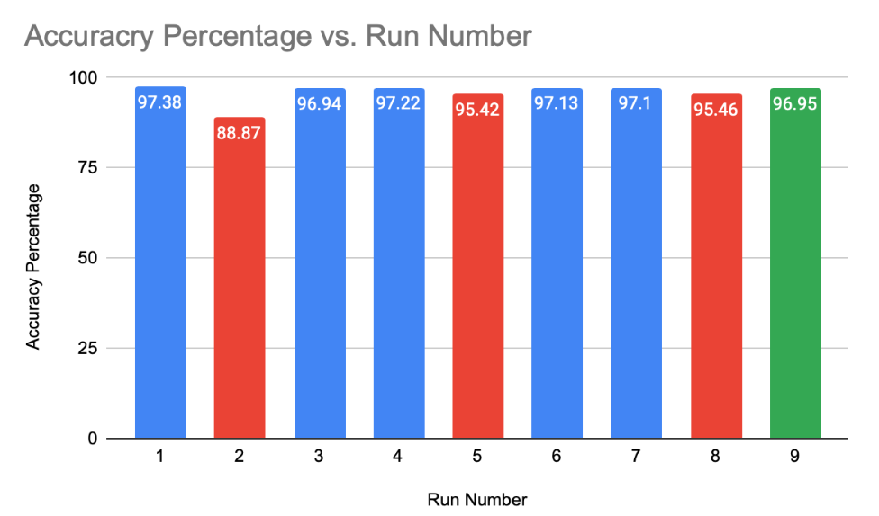

# Machine Learning Applications on Driving Behavior
# HTGR - Hit the Ground Running Team
## Summary

This Machine Learning Project is designed to hone Machine Learning concepts and algorithms. Over the course of a semester we took a [driving behavior dataset](https://www.kaggle.com/datasets/shashwatwork/driving-behavior-dataset), cleaned it up and split it in order to train and test our models. The data set was a car accelerometer and gyroscope time-series data that would be used to determine if the car movements, such as sudden acceleration, sudden right, sudden left or sudden break. With the preprocessed data, developed 3 different models: LSTM (Long short term memory), SVM (Support Vector Machine), and Random Forest Model to predict driving behavior through the preprocessed time-series data.

This project was completed in 3 months using agile methedology and self-study. 

Contributors:
- [insert names]

# LSTM Documentation 

Blue: accuracy of model run with training data

Red: accuracy of model run with validation data

Green: accuracy of model run with test data

For all the runs, did 10 epochs with batch size of 16.
- Run 1
    - Accuracy of model with Training Data: **97.38%**
- Run 2
    - Accuracy of model with Validation Data: **88.87%**
- Run 3
    - Accuracy of model with Training Data: **96.94%**
    - Nothing was changed in the code, but the slight decrease in accuracy could be a result of the new
validation data that was run with the model.
- Run 4
    - Training Data: **97.22%**
    - Nothing was changed in the code again, but the slight increase in accuracy could be a result of
the model having another run with the training data.
- Run 5
    - Validation Data: **95.42%**
    - This increase in accuracy from the first run (using the validation data) can be attributed to the
change in the number of epochs. We increased the number of epochs in the LSTM model from
10 to 30. In general, increasing the number of epochs helps improve accuracy of the model.
However, an excessive number of epochs can lead to overfitting the model, whereas an
insufficient number of epochs can cause underfitting the model.
- Run 6
    - Accuracy of model with Training Data: **97.13%**
    - Nothing was changed in the code; just retraining the model with the training data. The slight
decrease in accuracy could be a result of the new validation data that was run with the model.
- Run 7
    - Accuracy of model with Training Data: **97.10%**
    - Nothing was changed in the code; just retraining the model with the training data. Again, the
slight decrease in accuracy could be a result of the new validation data that was run with the
model.
- Run 8
    - Accuracy of model with Validation Data: **95.46%**
    - Nothing was changed in the code; just ran the model again with the validation data. The slight
increase in accuracy for the run with validation data could be a result of the model having
previous runs with the training data and validation data.
- Run 9
    - Accuracy of model with Test Data: **96.95%**
    - Nothing in the code was changed; ran the model using the test data.